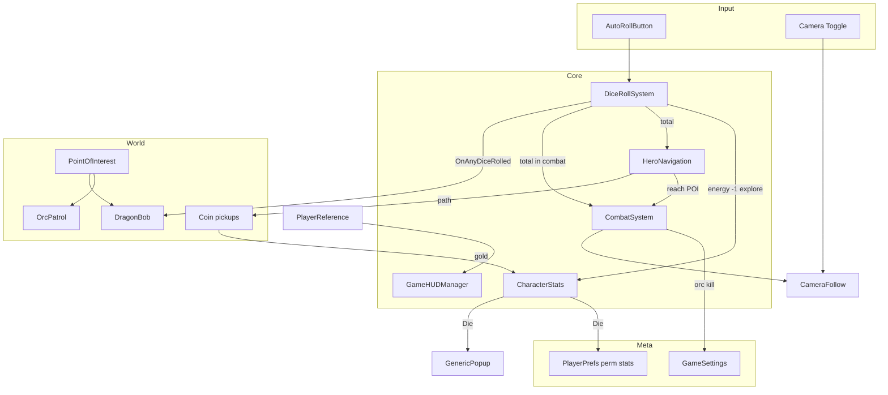
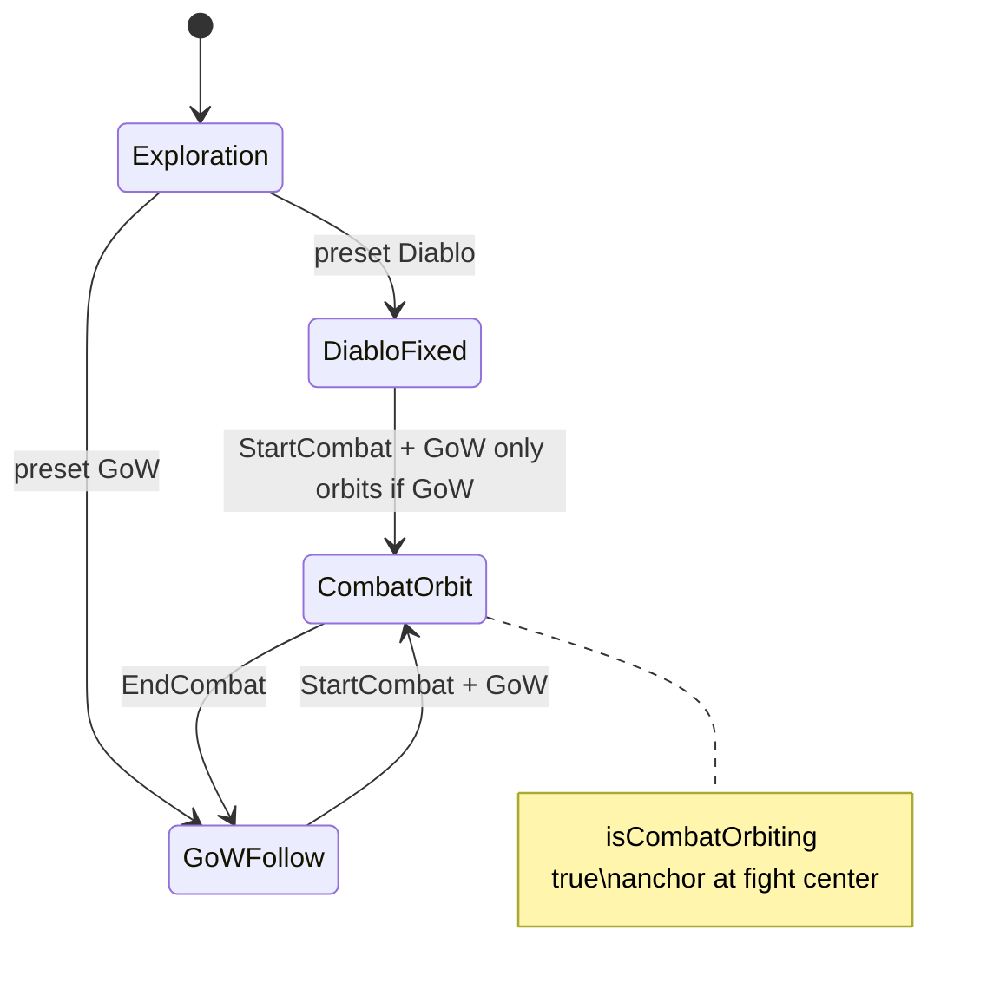
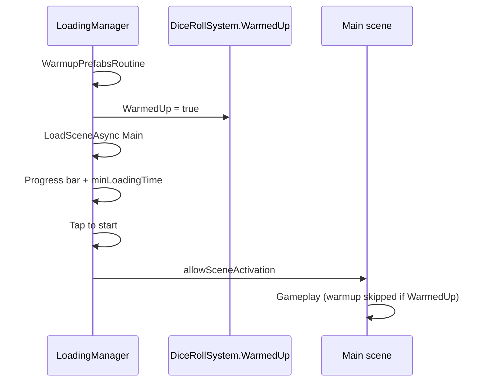
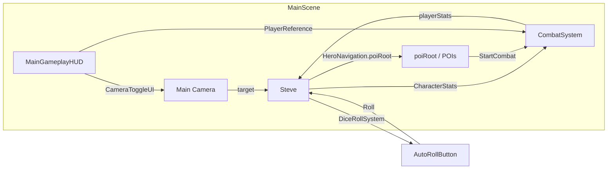

# Oakland — Game Architecture & Documentation

**Current version:** `v0.0.021` (tag `v0.0.021`)  
**Scenes:** `Assets/Scenes/Loading.unity` → `Assets/Scenes/Main.unity`  
**Player:** Steve (RPG Tiny Hero PBR)  
**Boss / FTUE:** Dragon Bob (flying shadow near player)  
**Core loop:** Roll dice → spend energy → move on NavMesh → collect coins → reach POIs → fight or loot → level up → die and rise (roguelite) → repeat

This document explains how every major system works, with extra depth on the **God of War (GoW)** camera mode (often abbreviated “GoW” in code and conversation).

---

## Table of Contents

1. [High-Level Overview](#1-high-level-overview)
2. [Game Loop (Step by Step)](#2-game-loop-step-by-step)
3. [Roguelite — Death & Rise](#3-roguelite--death--rise)
4. [Camera System — Diablo vs God of War (GoW)](#4-camera-system--diablo-vs-god-of-war-gow)
5. [Combat Flow](#5-combat-flow)
6. [Dice & Movement](#6-dice--movement)
7. [Stats, UI & Progression](#7-stats-ui--progression)
8. [Enemies & Points of Interest](#8-enemies--points-of-interest)
9. [Dragon Bob (FTUE Shadow)](#9-dragon-bob-ftue-shadow)
10. [Coins, Gold & Worms](#10-coins-gold--worms)
11. [Loading & Startup](#11-loading--startup)
12. [Script Reference](#12-script-reference)
13. [Scene Wiring Checklist](#13-scene-wiring-checklist)
14. [Scene Setup Guide (Detailed)](#14-scene-setup-guide-detailed)
15. [Asset Packs](#15-asset-packs)
16. [Versioning](#16-versioning)
17. [Extension Guide](#17-extension-guide)

---

## 1. High-Level Overview

Oakland is a **dice-driven exploration and combat roguelite** prototype built in Unity (URP). The player controls **Steve**, who:

- **Rolls dice** (costs 1 energy outside combat) to generate a number.
- **Outside combat:** that number becomes **movement distance** in meters along NavMesh paths to random POIs.
- **In combat:** that number becomes the **attack roll** added to melee damage (with crits on high rolls). Rolls resolve **instantly** — no waiting for physics to settle.
- **Reaches POIs** with orcs, mushrooms, treasure chests, worms (after unlock), or **Dragon Bob**.
- **Collects coins** spawned along the NavMesh path; gold is shown in UI and granted from kills/chests.
- **Levels up** from XP (exploration rolls and combat kills), choosing stat upgrades via **`GenericPopup`**.
- **Dies** and picks a **permanent stat bonus** stored in **`PlayerPrefs`**, then the scene reloads for the next run.
- **Dragon Bob** circles overhead casting a visible shadow — FTUE atmosphere, not a roaming land-and-fight boss in the current build.

Systems communicate through **singletons**, **events**, **`PlayerReference`**, and component references:

| Singleton / Hub | Role |
|-----------------|------|
| `CombatSystem.Instance` | Turn-based combat state machine |
| `LoadingManager` | Loading scene — warmup, async load, tap-to-start |
| `GameSettings.Instance` | Persistent progression (orc kill count → worm unlock) |
| `GenericPopup` (Resources prefab) | Modal popups — death, level up, chest loot, stats |
| `PlayerReference` | Resolves Steve's `CharacterStats` / `HeroNavigation` safely |
| `Camera.main` + `CameraFollow` | All camera behavior |

| Event | Publisher | Subscribers |
|-------|-----------|-------------|
| `DiceRollSystem.OnAnyDiceRolled` | After each roll resolves | `DragonBob` (flight height jitter) |



---

## 2. Game Loop (Step by Step)

### Boot sequence

1. **`Loading.unity`** runs **`LoadingManager`**:
   - **`WarmupPrefabsRoutine()`** — instantiates configured warmup prefabs at `y = -1000`, sets `DiceRollSystem.WarmedUp = true`.
   - **`LoadSceneAsync()`** — async loads **`Main`** with progress bar; waits **`minLoadingTime`** (default 3s).
   - Shows **“Tap to start”**; waits for pointer or any key, then activates the scene.
2. **`Main.unity`** begins gameplay. If `DiceRollSystem.WarmedUp` is already true (from Loading scene), Steve's dice system skips its own warmup.

### Exploration loop

1. Player taps **Roll** (or **AutoRollButton** long-press toggles auto-roll) → `DiceRollSystem.Roll()`.
2. If `CanRoll` (not busy, energy ≥ 1 outside combat): consume energy, play Steve's `Roll` animator trigger.
3. After 0.45s, spawn physics dice in **`WorldDiceContainer`** (world space, not parented to Steve).
4. Read face values via third-party **`DiceStats`** (highest child transform = face up).
5. Sum values; if **2 dice match**, total is **doubled** (“DOUBLES”).
6. **`AddXP(total)`** — exploration rolls only (combat rolls skip roll XP; kills grant separate XP — see [Combat Flow](#5-combat-flow)).
7. `DiceRollSystem` fires **`OnAnyDiceRolled(total)`** (Dragon Bob listens).
8. `HeroNavigation.OnDiceRolled(total)` adds `total × metersPerDicePoint` (default **2.5**) to `remainingMeters`, spawns **coins along the NavMesh path**, and moves toward a POI (first 3 rolls prefer **treasure chests** for FTUE).

### POI arrival

When Steve reaches a POI child with an enemy:

- If **movement remains** (`remainingMeters > 0`): apply **impact damage** first (`remainingMeters × currentHP/10`). May kill enemy without formal combat.
- If enemy survives (or no impact): **`CombatSystem.StartCombat(enemy)`**.
- If POI is empty: chain to next POI if distance remains.

### Combat loop

1. **Charge-in:** both sides lerp to facing positions (~2.5m apart), NavMesh disabled for player.
2. **Camera:** `CombatCameraAnchor` at midpoint; **`isCombatOrbiting = true`** (GoW orbit if preset is GoW).
3. **Turns:**
   - **Player turn:** roll dice → instant resolve → `OnPlayerRoll(total)` → damage.
   - **Enemy turn:** random d12 roll + melee damage, possibly crit.
4. **End:** winner animation, camera returns to Steve, NavMesh re-enabled, enemy destroyed on win. Chests open **`GenericPopup`** stat picker (impact kill or combat win).

### Auto-roll

- **`AutoRollButton`**: tap = single roll; **long-press (0.8s)** toggles `DiceRollSystem.autoRoll`.
- When auto-roll is on, `DiceRollSystem.Update()` rolls whenever `CanRoll` is true.
- **Exploration:** naturally throttled by movement (`IsSteveBusy`) and roll animation/physics.
- **Combat:** 0.75s cooldown between auto-rolls to prevent machine-gun attacks.

---

## 3. Roguelite — Death & Rise

When Steve's HP reaches 0:

1. **`CharacterStats.Die()`** runs (player only — enemies set `isDead = true` locally).
2. Active combat ends via **`CombatSystem.EndCombat(false)`** if needed.
3. **`GenericPopup`** shows **“STEVE HAS FALLEN”** with two permanent stat choices.
4. Bonus amount = **`permPointsToAssign`** (`pointsGainedThisRun / 2` — half of stat points earned this run).
5. Player picks a stat → **`ApplyPermUpgrade()`** writes to **`PlayerPrefs`** (`Perm_Brawn`, `Perm_Finesse`, etc.).
6. **Scene reloads** via `SceneManager.LoadScene(GetActiveScene().name)` — reloads **Main** directly (not Loading).
7. On next **`Awake`**, **`LoadPermStats()`** adds permanent bonuses to base attributes.

**Run tracking:**

| Field | Purpose |
|-------|---------|
| `pointsGainedThisRun` | Incremented by `ApplyStatUpgrade()` during the run |
| `permPointsToAssign` | `pointsGainedThisRun / 2` — offered on death |

**Note:** `DiceRollSystem.WarmedUp` is **static** and stays `true` after the first Loading-scene boot, so death-reload skips dice warmup.

---

## 4. Camera System — Diablo vs God of War (GoW)

**Scripts:** `CameraFollow.cs`, `CameraToggleUI.cs`  
**Toggle:** UI button swaps between `Diablo` and `GodOfWar` presets (not `Custom` in normal play).

### Shared behavior (`CameraFollow`)

- Runs in **`LateUpdate`** so it follows after character movement.
- **`target`**: Transform to orbit around (Steve, or `CombatCameraAnchor` in fights).
- **Position:** `target.position + rotation * (0, 0, -distance)`, smoothed with `smoothSpeed`.
- **Look-at:** always `target.position + Vector3.up * 1.5f` (chest height).
- **`Shake(duration, magnitude)`:** random offset while `shakeDuration > 0` (combat hits call this).

### Preset values (`ApplyPresets`)

| Preset | Distance | Pitch | Yaw | Feel |
|--------|----------|-------|-----|------|
| **Diablo** | 12 | 55° | 45° | High isometric ARPG — fixed world angle |
| **GodOfWar** | 6 | 25° | 0° (base) | Closer over-shoulder — **yaw follows target** |
| Custom | Inspector | Inspector | Inspector | Manual tuning |

### Diablo mode — how it works

```text
rotation = Euler(pitch, yaw, 0)   // FIXED world yaw — does NOT follow Steve's facing
offset   = rotation * (0, 0, -distance)
```

- Camera angle is **constant** relative to the world.
- Steve can walk in any direction; the map feels like classic isometric Diablo / CRPG.
- **Combat orbit is OFF** unless you separately enable `isCombatOrbiting` (orbit block still checks `preset == GodOfWar`).

### God of War (GoW) mode — how it works

GoW is **two behaviors**: exploration follow + combat showcase orbit.

#### Exploration (not in combat orbit)

```text
rotation = Euler(pitch, target.eulerAngles.y + yaw, 0)
```

- **Pitch** stays at 25° (from preset).
- **Yaw** = Steve's world Y rotation + optional offset.
- Camera **orbits behind** whichever way Steve faces — third-person action feel like God of War / action RPGs.
- When switching from combat back, `combatOrbitYaw` resets to `yaw`.

#### Combat (`isCombatOrbiting == true` AND `preset == GodOfWar`)

Activated in `CombatSystem.CombatTransitionRoutine`:

```csharp
combatCameraAnchor.position = midpoint(player, enemy);
camFollow.target = combatCameraAnchor;
camFollow.isCombatOrbiting = true;
```

Each frame in GoW combat:

```text
combatOrbitYaw += orbitSpeed * deltaTime   // default 40°/sec
rotation = Euler(pitch + 15, target.eulerAngles.y + combatOrbitYaw, 0)
```

- Camera **spins around the fight** at `orbitSpeed` (40°/s default).
- **Extra +15° pitch** tilts down for a more cinematic “showcase” angle.
- Anchor is the **center of the fight**, not Steve alone — both fighters stay framed.

Deactivated in `EndCombat`:

```csharp
camFollow.isCombatOrbiting = false;
camFollow.target = playerStats.transform;
Destroy(combatCameraAnchor);
```

### Camera toggle UI

`CameraToggleUI.ToggleCamera()` flips `Diablo ↔ GodOfWar` and updates the button icon (`diabloIcon` / `gowIcon`).

### When to use which mode

| Situation | Diablo | GoW |
|-----------|--------|-----|
| Map overview / planning routes | ✓ Best | Acceptable |
| Reading POI layout | ✓ Best | Harder (rotates with Steve) |
| Combat readability | Good (static) | ✓ Best (orbit + close) |
| “Action game” feel | Lower | ✓ Highest |



---

## 5. Combat Flow

**Script:** `CombatSystem.cs`

### Entry

`StartCombat(CharacterStats enemy)` — guarded by `!isInCombat`, enemy alive.

### Transition coroutine

1. Disable player `NavMeshAgent`; stop enemy agent.
2. Compute facing positions on NavMesh samples.
3. ~0.8s charge lerp + run anim; chest enemies don't move (`name.Contains("Chest")`).
4. “Ready” flinch (`GetHit` trigger both sides).
5. Setup combat camera anchor + orbit flag.
6. Start `CombatLoop()`.

### Player attack (`OnPlayerRoll`)

Called from `HeroNavigation.OnDiceRolled` when `isInCombat`:

```text
finalDamage = (rollValue + MeleeDamage) * (crit ? 2 : 1)
crit if rollValue >= critThreshold (default 11)
```

- Combat dice **instant-resolve** in `DiceRollSystem` (0.1s delay, no physics settle wait).
- Triggers: `Attack` → wait 0.1s → damage → floating text → optional blood FX → camera shake → enemy `GetHit`.
- If enemy HP ≤ 0: kill XP (`rollValue × amountPerKill`), `Die` → `EndCombat(true)`.
- Else: `isPlayerTurn = false`.

### XP in combat

| Source | When | Amount |
|--------|------|--------|
| Roll total | Exploration only | `AddXP(total)` in `ApplyResult` |
| Combat kill | Enemy HP ≤ 0 | `rollValue × amountPerKill` (default ×5) |

Combat rolls do **not** also grant roll-total XP (prevents double-dipping).

### Enemy attack

- Random `1..12` + `MeleeDamage`, crit doubles.
- Same timing pattern; damages player.

### Damage presentation

`SpawnDamageText` creates a **world-space Canvas** per popup:

- `FaceCamera` — billboards to camera rotation.
- `FloatingCombatText` — drifts up, fades, `Destroy` after 1.5s.

Also used for energy spend/regen (`CharacterStats`), gold, XP, and impact damage (`HeroNavigation`).

### End combat

- Reset animators, camera, NavMesh warp.
- Victory trigger on win; destroy enemy after 1.5s (3s for dragon).
- **Chest:** `ShowChestUpgradePopup()` → **`GenericPopup`** with +2 stat choice.
- **Other:** `HeroNavigation.ResumeAfterCombat()`.

### Busy rules (when roll is blocked)

`DiceRollSystem.IsSteveBusy()`:

- Moving in exploration (`heroNav.isMoving`), OR
- In combat AND (not player turn OR attack sequence running).

`TurnIndicatorUI` dims/disables roll button when `!diceSystem.CanRoll`.

---

## 6. Dice & Movement

### DiceRollSystem

| Setting | Default | Purpose |
|---------|---------|---------|
| `diceType` | D2 | Which prefab to spawn (D2 uses 6-sided mesh, maps 1–3→1, 4–6→2) |
| `amount` | 2 | Dice per roll |
| `scale` | 0.5 | World scale |
| `diceLifetime` | 3s | Before shrink-fade |
| `fadeDuration` | 1s | Shrink to zero then Destroy |
| `popForce` / `torqueForce` | 6 / 10 | Physics juice |
| `autoRoll` | false | Auto-roll when `CanRoll` (see cooldown in combat) |
| `WarmedUp` | static | Set by Loading scene; skips duplicate warmup |

**Prefab lookup:** `GetPrefabForType` searches `dicePrefabs` by name (`6Sided`, `4Sided`, etc.).

**World container:** Dice parented to `WorldDiceContainer` so they **stay where they land** when Steve walks away.

**Combat mode:** Pre-rolls values, calls `ApplyResult` immediately, fades dice as visual juice.

### HeroNavigation

| Setting | Default | Purpose |
|---------|---------|---------|
| `metersPerDicePoint` | 2.5 | Meters per pip on dice total |
| `coinPrefab` | — | Spawned every ~2.5m along path to target |
| `wormPrefab` | — | Rare ambush spawn on coin collect (after unlock) |
| `poiRoot` | — | Parent of POI transforms |
| `arrivalDistance` | 1.0 | NavMesh stop distance |

**POI selection:** Random without replacement; when list empty, `ResetPOIs()` refills from `poiRoot` children.

**Distance pool:** `remainingMeters` decrements by actual path distance each frame while moving. Reaching a POI with leftover distance can chain to the next POI or trigger impact/combat.

**Chest impact kill:** Uses `CombatSystem.ShowChestUpgradePopup()` (same as combat win).

---

## 7. Stats, UI & Progression

### CharacterStats

**Attributes:** Brawn, Finesse, Wit, Grit (+ permanent bonuses from `PlayerPrefs`)

**Derived (cached via `RefreshCachedStats`):**

| Stat | Formula |
|------|---------|
| MaxHP | `brawn × 5 + 10` |
| MaxMana (Energy) | `grit × 3 + 10` |
| MaxXP | `100 × 1.5^(level - 1)` |
| MeleeDamage | `brawn` |
| RangedDamage | `finesse` |
| Defense | `finesse / 2` |

**Energy:** Regenerates `manaRegenPerInterval` every `regenInterval` seconds (default 1 per **5s**). Rolls cost 1 energy outside combat; combat rolls are free.

**Level up:**

1. Passive +1 random stat (silent).
2. Full heal + energy refill.
3. **`GenericPopup`** — pick +2 to one of three random stats.

**Crit:** `critThreshold` default 11 — roll ≥ threshold doubles damage.

**Gold:** `coins` field; `AddGold(amount)` shows yellow floating text.

### PlayerReference

Central helper so UI never binds to enemy `CharacterStats`:

```csharp
PlayerReference.GetStats()       // CombatSystem.playerStats → HeroNavigation fallback
PlayerReference.GetNavigation()  // Steve's HeroNavigation
```

Used by **`GameHUDManager`**, **`StatDisplayConfig`**, **`CoinUI`**, **`StepDisplayUI`**, **`DragonBob`**.

### UI components

| Script | Updates when |
|--------|----------------|
| **`GameHUDManager`** | Main HUD — level, HP, XP, energy, coins (TMP + Layer Lab prefab) |
| **`StatDisplayConfig`** | Configurable stats popup via Heroes button |
| **`GenericPopup`** | Death, level up, chest loot (Resources `UI/GenericPopup`) |
| **`AutoRollButton`** | Tap roll / long-press toggle auto-roll |
| `HealthBar` | Every frame; enemy bars only visible for **current** combat target |
| `ManaBar` | Every frame; shows regen countdown |
| `CoinUI` | Coin count via `PlayerReference` |
| `StepDisplayUI` | Target name + distance + remaining move pool |
| `StatsUI` | Legacy character sheet panel (`Refresh`) |
| `TurnIndicatorUI` | Combat turn indicators + roll button pulse/dim (`CanRoll`) |
| `TreasureUpgradeUI` | **Legacy** — chest rewards now use `GenericPopup` |

### Main HUD prefab

**`MainGameplayHUD.prefab`** (Layer Lab + TextMesh Pro) hosts **`GameHUDManager`**. Wire `playerStats` to Steve or leave null — runtime resolves via **`PlayerReference`**.

---

## 8. Enemies & Points of Interest

### PointOfInterest

Placed on POI empties under `poiRoot`. On `Start`:

1. Picks prefab by `EnemyType` (see table below).
2. Scales non-boss enemies to **0.75** (Dragon Bob / worms use prefab scale).
3. Adds/configures `CharacterStats` and behavior scripts.
4. Spawns `HealthCanvas` at type-specific height.
5. **Mushrooms / worms:** proximity engagement in `Update` via `CheckProximityEngagement()`.

### OrcPatrol

- Random NavMesh points within `patrolRadius` of spawn.
- Pauses when this orc is `CombatSystem.currentEnemyStats`.
- **Flees** from Dragon Bob within `fearRadius`.
- **Engages** player within `engagementRadius` when not in combat.

### Enemy comparison

| Type | Moves | Combat | On death |
|------|-------|--------|----------|
| Orc | Patrol | Full turns | Gold 5–10; `RegisterOrcKill()` → worm unlock progress |
| Mushroom | Static | Full turns | Gold 5–10; resume navigation |
| TreasureChest | Static | Full turns | Gold 20–50; **`GenericPopup`** +2 stat |
| DragonBob | Flies (shadow) | FTUE combat possible | Gold 100–200; 3s destroy delay |
| Worm | Static ambush | Full turns | Spawned via coin collect (unlocked) |

---

## 9. Dragon Bob (FTUE Shadow)

**Script:** `DragonBob.cs` — on a dedicated POI (`EnemyType.DragonBob`) or placed in scene.

### Current behavior (v0.0.021)

Bob is locked to **`Flying`** state and acts as an **atmospheric shadow**:

- **`MaintainShadowNearPlayer()`** — positions Bob so his shadow orbits ~8m around Steve using the **cached directional light** (found once in `Start`, not every frame).
- **`PositionForInitialShadow()`** — FTUE placement on start so shadow is visible in front of Steve.
- Subscribes to **`DiceRollSystem.OnAnyDiceRolled`** — randomizes `flyHeight`, picks new fly-over target.
- **Scale 2.5×**, high brawn/grit (boss stats if combat triggers).
- **Roar routine** when flying near player horizontally.

### Legacy states (code present, forced to Flying)

| State | Intended behavior |
|-------|-------------------|
| `Landing` / `Resting` / `TakingOff` | Land at POI, block NavMesh, take off |
| `InCombat` | Boss fight via `CombatSystem` |

FTUE combat path (`isFTUECombat`) still exists in `CombatSystem.CombatLoop` — Bob screams and flies away without a full fight.

---

## 10. Coins, Gold & Worms

### Coin pickups (`Coin.cs`)

- Spawned by `HeroNavigation.SpawnCoinsAlongPath()` when heading to a new POI (~every 2.5m along NavMesh path).
- Rotates and bobs; **trigger collider** collects on player contact.
- **`Collect()`:** `stats.AddGold(1)`, then `TrySpawnWorm(position)`.

### Worm unlock (`GameSettings.cs`)

Persistent singleton (`DontDestroyOnLoad`):

| Setting | Default | Meaning |
|---------|---------|---------|
| `orcsKilledToUnlockWorms` | 2 | Orc kills before worms can ambush |
| `totalOrcsKilled` | runtime | Incremented via `RegisterOrcKill()` from combat or impact kills |

When unlocked, collecting a coin has **10% chance** to spawn a worm and immediately start combat.

### Gold rewards (impact kill, no combat)

| Enemy | Gold |
|-------|------|
| Orc / Mushroom | 5–10 |
| Chest | 20–50 |
| Dragon Bob | 100–200 |

---

## 11. Loading & Startup

**Build order** (`EditorBuildSettings`):

1. `Assets/Scenes/Loading.unity`
2. `Assets/Scenes/Main.unity`



**Removed in v0.0.014+:** `LoadingScreenUI`, `LoadingScreenSteve` — replaced by dedicated Loading scene + `LoadingManager`.

**Memory note:** Warmup prefab list size affects startup RAM. Keep the list to dice and other first-frame assets only.

---

## 12. Script Reference

### Custom gameplay scripts (`Assets/Scripts/`)

| Script | Responsibility |
|--------|----------------|
| `CameraFollow` | Diablo / GoW presets, combat orbit, shake |
| `CameraToggleUI` | Button to swap presets |
| `CharacterStats` | HP, energy, XP, level, gold, attributes, death/rise, perm stats |
| `CombatSystem` | Combat state machine, camera, damage text, chest popup |
| `DiceRollSystem` | Roll, physics, warmup flag, doubles, auto-roll, `OnAnyDiceRolled` |
| `HeroNavigation` | NavMesh, POIs, coins on path, impact, worms, FTUE chest bias |
| `PointOfInterest` | Spawn enemies at POIs (all `EnemyType` values) |
| `DragonBob` | Flying shadow AI, FTUE placement |
| `OrcPatrol` | Orc patrol, flee from Bob, player engagement |
| `Coin` | Pickup spin/bob, gold + worm trigger |
| **`GameHUDManager`** | Main gameplay HUD (level, HP, XP, energy, coins) |
| **`StatDisplayConfig`** | Configurable hero stats popup |
| **`GenericPopup`** | Modal system — death, level up, chest, stats |
| **`AutoRollButton`** | Tap roll / long-press auto-roll toggle |
| **`PlayerReference`** | Safe Steve stats/navigation lookup |
| **`LoadingManager`** | Loading scene — warmup, async load, tap-to-start |
| `CoinUI` | HUD gold display (legacy/alternate) |
| `StepDisplayUI` | HUD target + moves remaining |
| `GameSettings` | Orc kill counter, worm unlock gate |
| `HealthBar` | HP fill + combat visibility |
| `ManaBar` | Energy fill + regen timer text |
| `StatsUI` | Legacy character sheet panel |
| `TurnIndicatorUI` | Turn + roll button state |
| `TreasureUpgradeUI` | Legacy chest UI (superseded by GenericPopup) |
| `FloatingCombatText` | Damage number lifetime |
| `FaceCamera` | Billboard world UI to camera |
| `AnimatorUtils` | Safe animator param helpers |

### Third-party / package scripts (not in `Assets/Scripts/`)

| Script | Package |
|--------|---------|
| `DiceStats` | Animated Dice — reads upward face each frame |
| `DiceHighlight` | Animated Dice — optional highlight |

### Animator parameters used

| Parameter | Used by |
|-----------|---------|
| `Speed` | Walk/run blend (Steve, orcs) |
| `Roll` | Dice roll wind-up |
| `Attack` | Melee |
| `GetHit` | Flinch |
| `Die` | Death |
| `Victory` | Win pose |

`AnimatorUtils.SafeSetFloat/Trigger` skips missing params (different enemies use different controllers).

---

## 13. Scene Wiring Checklist

Quick pass/fail list. For step-by-step hierarchy, inspector fields, and prefab wiring, see **[Section 14 — Scene Setup Guide](#14-scene-setup-guide-detailed)**.

### Steve (player)

- [ ] `NavMeshAgent` + `Animator` + `CharacterStats` + `HeroNavigation` + `DiceRollSystem`
- [ ] `HeroNavigation.poiRoot` → POI parent object
- [ ] `HeroNavigation.coinPrefab` / `wormPrefab` assigned
- [ ] `CombatSystem.playerStats` → Steve's `CharacterStats`
- [ ] `GameSettings` object in scene (persistent)

### Camera

- [ ] Main Camera has `CameraFollow` (`target` = Steve)
- [ ] `CameraToggleUI` on HUD camera button wired to `CameraFollow`

### Managers & UI

- [ ] `CombatSystem` singleton with `playerStats`, optional `hitEffectPrefab`
- [ ] `MainGameplayHUD` prefab in scene with `GameHUDManager`
- [ ] `Button_Roll` has **`AutoRollButton`** → Steve's `DiceRollSystem`
- [ ] `Nav_HEROES` button → `GameHUDManager` (via `heroesButton` or `StatDisplayConfig`)

### Loading scene (`Loading.unity`)

- [ ] `LoadingManager` with `sceneToLoad = "Main"`
- [ ] `warmupPrefabs`, progress bar, tap-to-start text wired

### World

- [ ] NavMesh baked
- [ ] `poiRoot` with POI children (`PointOfInterest` + prefab refs)
- [ ] `EventSystem` in both scenes

### Resources & build

- [ ] `Resources/UI/GenericPopup` prefab exists
- [ ] Build settings: **Loading** → **Main** only

---

## 14. Scene Setup Guide (Detailed)

This section walks through **every GameObject**, **component**, and **inspector reference** needed to rebuild the game from scratch.

### Build settings first

**File → Build Settings:**

| Index | Scene | Notes |
|-------|-------|-------|
| 0 | `Assets/Scenes/Loading.unity` | Entry point — always play from here |
| 1 | `Assets/Scenes/Main.unity` | Gameplay |

Remove any stale scenes (e.g. `SampleScene`). **Play Mode** should start in **Loading**, not Main, so warmup and tap-to-start run correctly.

---

### Scene A — `Loading.unity`

#### Hierarchy (reference layout)

```text
Loading
├── Directional Light          (shadows ON — Dragon Bob shadow math uses this)
├── Main Camera
├── EventSystem                (Input System UI module)
├── Canvas                     (Screen Space Overlay)
│   ├── Slider_LoadingBar      (Unity UI Slider → Fill child)
│   ├── Text_LoadingValue      (TMP — "Loading... 42%")
│   ├── TapToStart             (TMP — hidden until load complete)
│   └── … (decorative Layer Lab art — optional)
└── LoadingManager             (empty GameObject, script only)
```

#### `LoadingManager` — inspector fields

| Field | Wire to | Value / notes |
|-------|---------|---------------|
| **Scene To Load** | — | `"Main"` (must match Main scene name in Build Settings) |
| **Min Loading Time** | — | `3` seconds minimum before tap-to-start appears |
| **Progress Bar** | `Slider_LoadingBar` | Unity `Slider` component |
| **Progress Text** | `Text_LoadingValue` | TMP text showing percentage |
| **Background** | Canvas background `Image` | Optional full-screen image |
| **Tap To Start Text** | `TapToStart` GameObject | Shown at 100%; hidden during load |
| **Warmup Prefabs** | Dice prefabs + heavy assets | Same dice you use in gameplay — forces shader/mesh load |

**Warmup prefab list:** drag in the dice prefabs from `Animated Dice (Random Art Attack)/HighPolyDice/` that `DiceRollSystem` actually rolls (typically `6SidedHighPoly` variants). Loading sets `DiceRollSystem.WarmedUp = true` when done.

#### Loading scene — do NOT add

- No `CombatSystem`, Steve, or POIs here
- No `DontDestroyOnLoad` gameplay managers (except what Main creates later)

---

### Scene B — `Main.unity`

#### Top-level hierarchy (recommended)

```text
Main
├── Environment                (Synty terrain/meshes — static, NavMesh surface)
├── Directional Light          (shadows ON)
├── Main Camera                (+ CameraFollow)
├── EventSystem
│
├── --- GAMEPLAY ---
├── Steve                      (player — see below)
├── poiRoot                    (empty parent — all POIs are children)
│   ├── POI_Orc_01
│   ├── POI_Chest_01
│   ├── POI_Mushroom_01
│   ├── POI_DragonBob_01       (optional)
│   └── …
│
├── --- MANAGERS (empty GameObjects) ---
├── CombatSystem
├── GameSettings
├── WorldDiceContainer         (optional — auto-created if missing)
│
└── MainGameplayHUD            (prefab instance — see UI section)
```

Keep **managers as siblings**, not nested under Steve, so references stay stable when Steve is destroyed/reloaded on death.

---

### GameObject: **Steve** (player)

**Source model:** `RPGTinyHeroWavePBR` — drag the Steve prefab or assemble from the Wave PBR hero mesh. Assign **`Steve_Animator.controller`**.

#### Required components (all on root)

| Component | Purpose | Key settings |
|-----------|---------|--------------|
| **Transform** | World position | Place on baked NavMesh |
| **NavMeshAgent** | Pathfinding | Speed ~3.5, stopping distance ~0.5, radius fits capsule |
| **Animator** | Roll / Attack / GetHit / Victory | Controller = `Steve_Animator` |
| **CharacterStats** | HP, energy, XP, level, gold | Default brawn/finesse/wit/grit; perm stats load in `Awake` |
| **HeroNavigation** | POI targeting, movement pool, coins | See refs below |
| **DiceRollSystem** | Roll physics + combat instant resolve | See refs below |
| **CapsuleCollider** | Coin pickup triggers | IsTrigger optional on child |

#### `HeroNavigation` — inspector

| Field | Wire to |
|-------|---------|
| **Poi Root** | `poiRoot` transform (parent of all POI empties) |
| **Meters Per Dice Point** | `2.5` (default) |
| **Arrival Distance** | `1.0` |
| **Coin Prefab** | `Assets/Coins/Prefabs/Coins/coin_01.prefab` (or your coin) |
| **Worm Prefab** | `RPGMonsterBundlePBR/.../WormMonsterPBRDefault.prefab` |

#### `DiceRollSystem` — inspector

| Field | Wire to |
|-------|---------|
| **Dice Type** | `D2` (uses 6-sided mesh, maps to 1–2) |
| **Amount** | `2` |
| **Dice Prefabs** | List of Animated Dice prefabs (`6Sided…`, etc.) |
| **Dice Material** | Shared dice material (optional) |
| **Steve Animator** | Steve's `Animator` (auto-finds parent if null) |
| **Hero Nav** | Steve's `HeroNavigation` (auto-finds parent if null) |
| **Result Text** | Legacy `UnityEngine.UI.Text` on a world/screen canvas (optional float text) |

**Weapon spawn point:** combat dice burst from a child transform whose name contains `weapon_r` (searched at runtime).

#### Optional child: floating roll result

Small world-space or screen canvas with `Text` for the dice total. Assign to `DiceRollSystem.resultText`. Can leave unassigned — HUD still works.

---

### GameObject: **CombatSystem** (empty + script)

| Field | Wire to |
|-------|---------|
| **Player Stats** | Steve's `CharacterStats` — **critical** |
| **Hit Effect Prefab** | `Resources/FX_Blood_Splatter_01` or assigned in inspector |

No other fields required. `currentEnemyStats` is set at runtime. Singleton assigns `Instance` in `Awake`.

**Cross-reference:** `CombatSystem.playerStats` is the authoritative player reference. `PlayerReference.GetStats()` reads this first.

---

### GameObject: **GameSettings** (empty + script)

| Field | Default |
|-------|---------|
| **Orcs Killed To Unlock Worms** | `2` |

`Awake` sets `DontDestroyOnLoad` and `Instance`. Only **one** per project — duplicate destroys itself.

---

### GameObject: **poiRoot** + POI children

`poiRoot` is an **empty Transform** parent. Each child is a POI marker placed on the NavMesh where enemies should spawn.

#### Per POI child (e.g. `POI_Orc_01`)

1. Create empty GameObject at desired world position.
2. Add **`PointOfInterest`** component.
3. Set **Enemy Type** and assign prefabs:

| Enemy Type | Prefab field | Typical prefab path |
|------------|--------------|---------------------|
| Orc | `orcPrefab` | `RPGMonsterBundlePBR/.../OrcPBRDefault.prefab` |
| TreasureChest | `chestPrefab` | Chest prefab from monster bundle / Coins pack |
| Mushroom | `mushroomPrefab` | `MushroomSmilePBRDefault.prefab` |
| DragonBob | `dragonPrefab` | `FourEvilDragonsPBR` dragon prefab |
| Worm | `wormPrefab` | Usually spawned at runtime — POI optional |

4. Assign **`healthCanvasPrefab`** → `Assets/Prefabs/HealthCanvas.prefab` (shared across POIs).

#### POI tuning fields

| Field | Orc | Mushroom / Worm | Chest |
|-------|-----|-----------------|-------|
| `patrolRadius` | `4` | — | — |
| `engagementRadius` | `3.5` | `3.5` | — |

**Spawn behavior (`Start`):** `PointOfInterest.EnsureEnemy()` instantiates the prefab as a **child** of the POI, adds `CharacterStats`, and attaches `OrcPatrol` (orcs) or `DragonBob` (dragon POI). You do **not** place orcs manually — only POI empties.

```text
poiRoot
└── POI_Orc_01                 (PointOfInterest — empty at edit time)
    └── Orc_TreasureChest_POI_Orc_01   (spawned at runtime)
        ├── mesh / animator
        ├── CharacterStats
        ├── OrcPatrol
        └── HealthCanvas       (spawned from healthCanvasPrefab)
```

**FTUE chest bias:** first 3 exploration rolls prefer treasure chest POIs (logic in `HeroNavigation`).

---

### GameObject: **Main Camera**

| Component | Settings |
|-----------|----------|
| **Camera** | Main tag, URP compatible |
| **CameraFollow** | `target` = Steve transform; `preset` = Diablo or GodOfWar; `smoothSpeed` ~5 |

Combat camera anchor is **created at runtime** — do not place it in the scene.

---

### Prefab: **MainGameplayHUD** (`Assets/Prefabs/UI/MainGameplayHUD.prefab`)

Drag into Main scene (one instance). Root is a **Canvas** (Screen Space Overlay, sort order 100) with **`GameHUDManager`**.

#### HUD hierarchy (simplified)

```text
MainGameplayHUD                (Canvas + GameHUDManager + CanvasScaler + GraphicRaycaster)
├── [Top-left cluster]         (level, XP slider, HP slider — Layer Lab widgets)
│   ├── Slider                 (XP bar — blue fill)
│   └── Slider_Stamina         (HP bar — red fill; name is legacy)
├── [Top-right cluster]        (energy text, coin count, gem placeholder)
├── Button_Camera              (+ CameraToggleUI)
│   └── Icon
└── BottomNav
    ├── Button_Roll            (+ AutoRollButton — add if missing)
    ├── Nav_HEROES             (stats popup)
    ├── Button_Boss            (placeholder)
    └── …
```

#### `GameHUDManager` — inspector

| Field | Object in prefab | Notes |
|-------|------------------|-------|
| **Player Stats** | Leave **empty** | Runtime resolves via `PlayerReference.GetStats()` |
| **Level Text** | Level number TMP | |
| **Hp Fill** | `Slider_Stamina/FillArea/Fill` | Red HP bar |
| **Hp Text** | `Text_StaminaValue` | `"120/140"` format |
| **Xp Fill** | `Slider/FillArea/Fill` | Blue XP bar |
| **Xp Text** | `Text_Value` | |
| **Energy Text** | Top-bar energy TMP | `"8 / 10"` |
| **Coin Text** | Coin counter TMP | |
| **Roll Button** | `Button_Roll` | Used by Heroes wiring; roll input via AutoRollButton |
| **Heroes Button** | `Nav_HEROES` | Opens stats popup |
| **Stats Config** | Optional `StatDisplayConfig` on same object | If set, Heroes uses config; else built-in stat list |

#### `Button_Roll` — add **`AutoRollButton`**

If not already on the prefab:

1. Select `BottomNav/Button_Roll`.
2. Add component **`AutoRollButton`**.
3. Wire:

| Field | Value |
|-------|-------|
| **Dice System** | Steve's `DiceRollSystem` (drag from hierarchy) |
| **Button Text** | TMP child on the button (shows ROLL / AUTO ROLL) |
| **Long Press Threshold** | `0.8` |

**Remove** any old `Button.onClick → DiceRollSystem.Roll` if you add `AutoRollButton` — the script handles tap via pointer events (`IPointerDownHandler` / `Up`).

#### `Button_Camera` — **`CameraToggleUI`**

| Field | Value |
|-------|-------|
| **Camera Follow** | Main Camera's `CameraFollow` (auto-finds if null) |
| **Toggle Button** | `Button_Camera` |
| **Icon Image** | Child `Icon` Image |
| **Diablo Icon / Gow Icon** | Sprites for current mode |

---

### GameObject: **WorldDiceContainer** (optional)

Empty GameObject at origin. `DiceRollSystem` creates this automatically if missing. Dice parent here so they stay in world space when Steve walks away.

---

### Resources (not in scene — must exist on disk)

| Path | Used by |
|------|---------|
| `Assets/Resources/UI/GenericPopup.prefab` | Death, level up, chest loot |
| `Assets/Resources/Fonts/Alata-Regular SDF` | Floating combat/damage text |
| `Assets/Resources/FX_Blood_Splatter_01` | Combat hit FX (optional fallback load) |

Popups are **instantiated at runtime** — no scene placement needed.

---

### Reference diagram — who talks to whom



---

### Setup order (recommended)

1. **Environment** — place terrain/meshes, bake **NavMesh** (Window → AI → Navigation).
2. **Steve** — place on NavMesh, add all player components, wire dice list.
3. **poiRoot** — place POI empties, configure `PointOfInterest` + prefabs.
4. **Managers** — `CombatSystem` (wire `playerStats`), `GameSettings`.
5. **Camera** — `CameraFollow.target` = Steve.
6. **HUD prefab** — instance `MainGameplayHUD`, wire `AutoRollButton.diceSystem` = Steve.
7. **EventSystem** — ensure one exists (Unity UI input).
8. **Play test from Loading scene** — confirm warmup, tap-to-start, roll, move, combat.

---

### Verification checklist (play mode)

| Symptom | Likely missing wire |
|---------|---------------------|
| Steve doesn't move after roll | `HeroNavigation.poiRoot` empty or no POI children |
| Roll does nothing | `AutoRollButton.diceSystem` or zero energy |
| HUD shows wrong HP / stuck at 0 | `CombatSystem.playerStats` not Steve |
| Combat never starts | POI missing prefab or `healthCanvasPrefab`; enemy not spawning |
| No popup on death/level/chest | `Resources/UI/GenericPopup` missing |
| Camera doesn't follow | `CameraFollow.target` null |
| Double warmup / long second load | Playing Main directly instead of Loading |
| Worms never appear | Need 2 orc kills via `GameSettings`; check Console for unlock log |

---

## 15. Asset Packs

| Folder | Contents |
|--------|----------|
| `RPGTinyHeroWavePBR` | Steve model, `Steve_Animator.controller` |
| `RPGMonsterBundlePBR` | Orc, chest, mushroom, worm + animators |
| `FourEvilDragonsPBR` | Dragon Nightmare / Soul Eater / Terror Bringer / Usurper |
| `Animated Dice (Random Art Attack)` | Dice prefabs, `DiceStats`, materials |
| `Coins` | Coin/chest pickup meshes and prefabs |
| `Synty` | Environment (Polygon Nature, etc.) |
| `Layer Lab` | UI kit — HUD prefabs, buttons, panels |
| `Prefabs/HealthCanvas.prefab` | World-space enemy HP bar |
| `Prefabs/MainGameplayHUD.prefab` | Main HUD with `GameHUDManager` |

---

## 16. Versioning

Git tags follow **`v0.0.00X`** on `main`:

| Tag | Summary |
|-----|---------|
| v0.0.002 | Loading screen, combat polish |
| v0.0.003 | Rogue light / POI / treasure first pass |
| v0.0.004 | Optimizations |
| v0.0.005 | Mushroom enemy, health bar combat cleanup |
| v0.0.006 | Camera toggle, minor fixes |
| v0.0.007 | Working build + dragons import |
| v0.0.008 | `DOCUMENTATION.md` first published |
| v0.0.009 | Stable — coins, step UI, dragon bob |
| v0.0.010 | Super stable — dragon flight polish |
| v0.0.011 | Very solid — `GameSettings`, core refactors |
| v0.0.012 | Documentation updated to match v0.0.011 gameplay |
| v0.0.013 | UI overhaul — Layer Lab + TextMesh Pro, removed RR Studio |
| v0.0.014 | Pathing/optimizations — scenes moved to `Assets/Scenes/`, `LoadingManager` |
| v0.0.015 | New loading screen |
| v0.0.016 | Leveling v0 + new HUD — `GameHUDManager`, `MainGameplayHUD` |
| v0.0.017 | Stable polish — `GenericPopup`, `StatDisplayConfig`, Resources fonts |
| v0.0.018 | Bug-free state |
| v0.0.019 | Roguelite — death/rise loop, `AutoRollButton`, perm stats via PlayerPrefs |
| v0.0.020 | Stable — combat, stats, navigation, POI, popup polish |
| **v0.0.021** | **Audit fixes — `PlayerReference`, combat XP, auto-roll cooldown, unified chest popup, build settings** |

**Next gameplay ship:** `v0.0.022`

---

## 17. Extension Guide

### Add a new enemy type

1. Add enum value to `EnemyType` in `PointOfInterest.cs`.
2. Add prefab field + `SpawnEnemy` case.
3. Set stats and static vs patrol behavior.
4. Assign on POI in scene.

### Add a new modal popup

1. Use **`GenericPopup.Show(title, message, btn1, btn2, btn3, actions...)`**.
2. Optionally call **`popup.AddStat(label, value)`** for structured stat rows.
3. Prefab lives at **`Resources/UI/GenericPopup`**.

### Wire UI to Steve safely

Always use **`PlayerReference.GetStats()`** — never bare `FindAnyObjectByType<CharacterStats>()` (may return an enemy).

### Add a new camera preset

1. Extend `CameraFollow.CameraPreset` enum.
2. Add case in `ApplyPresets()` and `LateUpdate()` rotation logic.
3. Update `CameraToggleUI` if it should be player-selectable.

### Make combat use Diablo camera during fights

In `CombatSystem`, after creating anchor, either:

- Skip `isCombatOrbiting = true`, or
- Orbit regardless of preset (change `LateUpdate` condition).

### Reduce Editor memory warnings

- Shrink warmup prefab list to only used types.
- Pool `SpawnDamageText` canvases.
- Disable Deep Profiler; clear Console on Play.
- Close unused Unity panels (AI Toolkit, Profiler).

### WebGL build

1. Build settings: **Loading** → **Main** only.
2. Do not commit the build output folder.
3. itch.io recommended for hosting.

---

## Quick FAQ

**Q: Why doesn't GoW orbit in Diablo mode during combat?**  
A: Orbit is gated: `isCombatOrbiting && preset == GodOfWar`. Diablo keeps a fixed world angle even in combat.

**Q: Why do dice stay in the world when I walk?**  
A: They're parented to `WorldDiceContainer`, not Steve.

**Q: What does a "double" do?**  
A: Doubles the **sum** of both dice — doubles movement distance in exploration and doubles the **roll value** used for damage in combat.

**Q: Can I roll with 0 energy?**  
A: No outside combat. `CanRoll` requires `currentMana >= 1`; each exploration roll calls `ConsumeMana(1)`. Combat rolls are free.

**Q: How does XP work in combat vs exploration?**  
A: Exploration rolls grant XP equal to the dice total. Combat kills grant `rollValue × amountPerKill` — not both.

**Q: What happens when Steve dies?**  
A: Pick a permanent stat bonus (stored in PlayerPrefs), then Main scene reloads. Permanent stats persist across runs.

**Q: Why doesn't death go back to the Loading scene?**  
A: Intentional roguelite flow — reloads Main directly. `DiceRollSystem.WarmedUp` stays true.

**Q: How do I toggle auto-roll?**  
A: Long-press the roll button (0.8s) via **`AutoRollButton`**.

**Q: When do worms appear?**  
A: After `GameSettings.totalOrcsKilled >= orcsKilledToUnlockWorms` (default 2 orc kills). Then coin pickups have a 10% ambush chance.

**Q: What chest UI is used?**  
A: **`GenericPopup`** via `CombatSystem.ShowChestUpgradePopup()` — both impact kills and combat wins.

**Q: Where is the doc in the repo?**  
A: Root file **`DOCUMENTATION.md`** — last updated for **`v0.0.021`**.

---

*Last updated for Oakland v0.0.021. Regenerate this section when shipping new tags or changing GoW camera behavior.*
