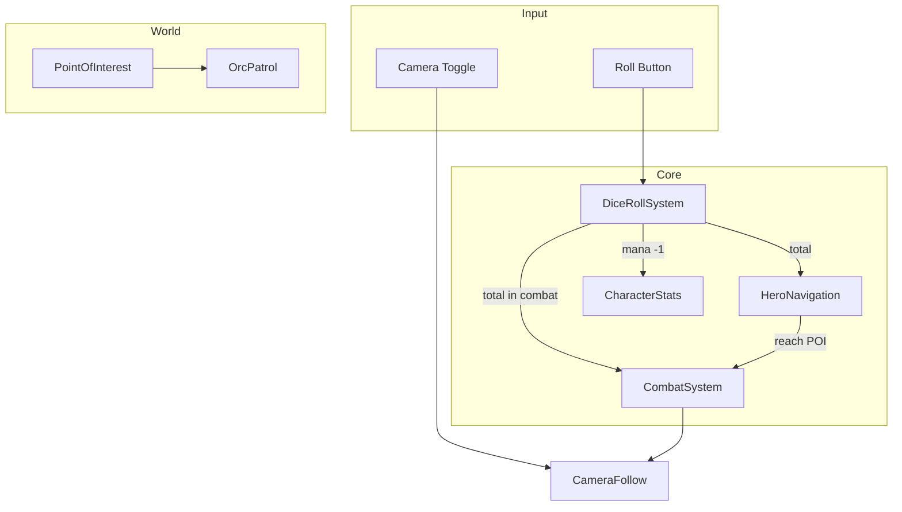
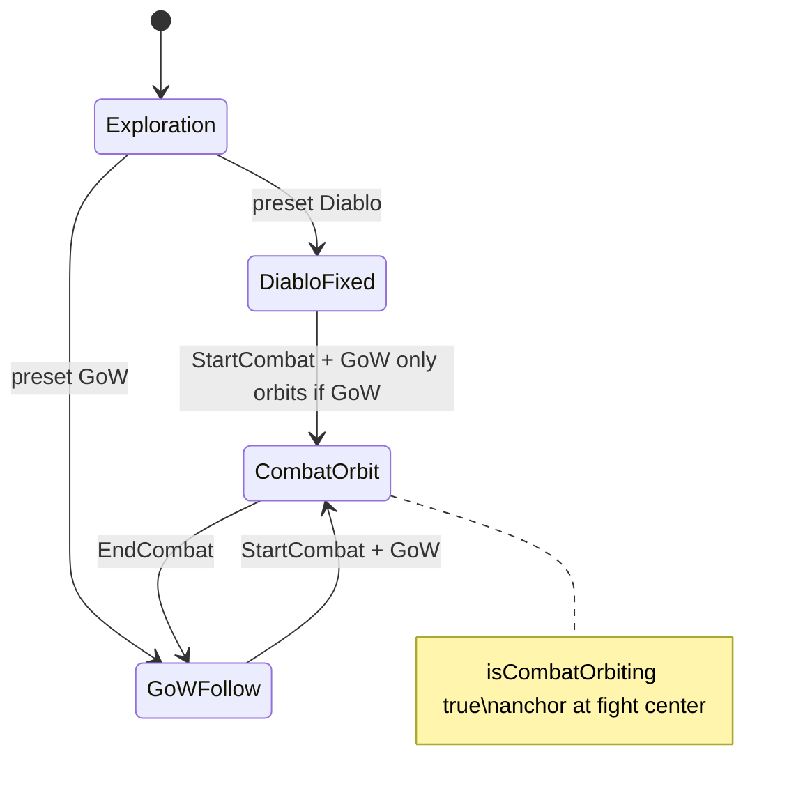
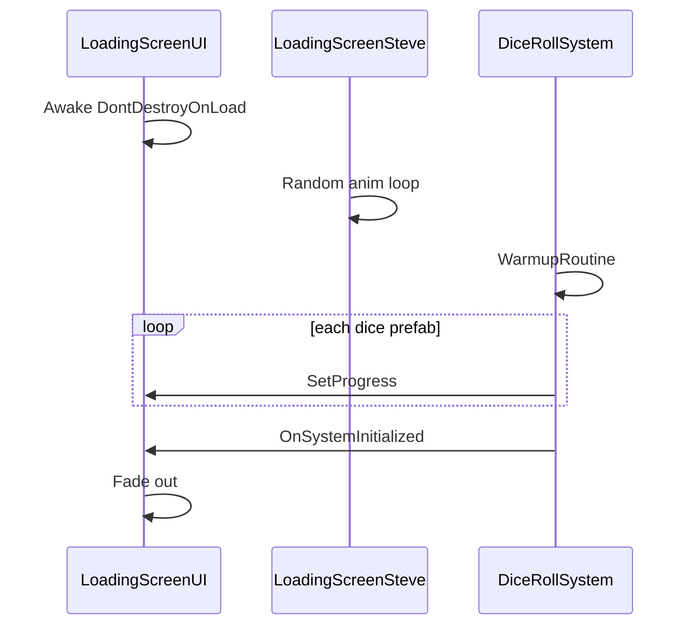

# Oakland — Game Architecture & Documentation

**Current version:** `v0.0.007` (tag `v0.0.007`)  
**Main scene:** `Assets/Main.unity`  
**Player:** Steve (RPG Tiny Hero PBR)  
**Core loop:** Roll dice → spend mana → move on NavMesh → reach POIs → fight or loot → repeat

This document explains how every major system works, with extra depth on the **God of War (GoW)** camera mode (often abbreviated “GoW” in code and conversation).

---

## Table of Contents

1. [High-Level Overview](#1-high-level-overview)
2. [Game Loop (Step by Step)](#2-game-loop-step-by-step)
3. [Camera System — Diablo vs God of War (GoW)](#3-camera-system--diablo-vs-god-of-war-gow)
4. [Combat Flow](#4-combat-flow)
5. [Dice & Movement](#5-dice--movement)
6. [Stats, UI & Progression](#6-stats-ui--progression)
7. [Enemies & Points of Interest](#7-enemies--points-of-interest)
8. [Loading & Startup](#8-loading--startup)
9. [Script Reference](#9-script-reference)
10. [Scene Wiring Checklist](#10-scene-wiring-checklist)
11. [Asset Packs](#11-asset-packs)
12. [Versioning](#12-versioning)
13. [Extension Guide](#13-extension-guide)

---

## 1. High-Level Overview

Oakland is a **dice-driven exploration and combat** prototype built in Unity (URP). The player controls **Steve**, who:

- **Rolls dice** (costs 1 mana) to generate a number.
- **Outside combat:** that number becomes **movement distance** in meters along NavMesh paths to random POIs.
- **In combat:** that number becomes the **attack roll** added to melee damage (with crits on high rolls).
- **Reaches POIs** that may contain orcs (patrolling), mushrooms (static), or treasure chests (static, offer stat upgrades).

Systems communicate through a few **singletons** and direct component references:

| Singleton / Hub | Role |
|-----------------|------|
| `CombatSystem.Instance` | Turn-based combat state machine |
| `LoadingScreenUI.Instance` | Boot loading overlay |
| `TreasureUpgradeUI.Instance` | Chest reward picker |
| `Camera.main` + `CameraFollow` | All camera behavior |



---

## 2. Game Loop (Step by Step)

### Boot sequence

1. **`LoadingScreenUI`** awakens, becomes a persistent overlay (`DontDestroyOnLoad`).
2. **`LoadingScreenSteve`** plays random idle/dance/victory animations on the loading screen.
3. **`DiceRollSystem.WarmupRoutine()`** runs:
   - Instantiates every dice prefab at `y = -500` to force shader/mesh load.
   - Reports progress to `LoadingScreenUI.SetProgress(0.05 → 1.0)`.
   - Destroys temp dice, calls `LoadingScreenUI.OnSystemInitialized()`.
4. Loading screen fades out; gameplay begins.

### Exploration loop

1. Player taps **Roll** → `DiceRollSystem.Roll()`.
2. If `CanRoll` (not busy, mana ≥ 1): consume mana, play Steve’s `Roll` animator trigger.
3. After 0.45s, spawn physics dice in **`WorldDiceContainer`** (world space, not parented to Steve).
4. Read face values via third-party **`DiceStats`** (highest child transform = face up).
5. Sum values; if **2 dice match**, total is **doubled** (“DOUBLES”).
6. `HeroNavigation.OnDiceRolled(total)` adds `total × metersPerDicePoint` to `remainingMeters` and starts NavMesh movement toward a random POI.

### POI arrival

When Steve reaches a POI child with an enemy:

- If **movement remains** (`remainingMeters > 0`): apply **impact damage** first (`remainingMeters × currentHP/10`). May kill enemy without formal combat.
- If enemy survives (or no impact): **`CombatSystem.StartCombat(enemy)`**.
- If POI is empty: chain to next POI if distance remains.

### Combat loop

1. **Charge-in:** both sides lerp to facing positions (~2.5m apart), NavMesh disabled for player.
2. **Camera:** `CombatCameraAnchor` at midpoint; **`isCombatOrbiting = true`** (GoW orbit if preset is GoW).
3. **Turns:**
   - **Player turn:** roll dice → `OnPlayerRoll(total)` → attack animation → damage.
   - **Enemy turn:** random d12 roll + melee damage, possibly crit.
4. **End:** winner animation, camera returns to Steve, NavMesh re-enabled, enemy destroyed on win. Chests open **`TreasureUpgradeUI`**.

---

## 3. Camera System — Diablo vs God of War (GoW)

**Scripts:** `CameraFollow.cs`, `CameraToggleUI.cs`  
**Toggle:** UI button swaps between `Diablo` and `GodOfWar` presets (not `Custom` in normal play).

### Shared behavior (`CameraFollow`)

- Runs in **`LateUpdate`** so it follows after character movement.
- **`target`**: Transform to orbit around (Steve, or `CombatCameraAnchor` in fights).
- **Position:** `target.position + rotation * (0, 0, -distance)`, smoothed with `smoothSpeed`.
- **Look-at:** always `target.position + Vector3.up * 1.5f` (chest height).
- **`Shake(duration, magnitude)`:** random offset while `shakeDuration > 0` (combat hits call this).

### Preset values (`ApplyPresets`)

| Preset | Distance | Pitch | Yaw | Feel |
|--------|----------|-------|-----|------|
| **Diablo** | 12 | 55° | 45° | High isometric ARPG — fixed world angle |
| **GodOfWar** | 6 | 25° | 0° (base) | Closer over-shoulder — **yaw follows target** |
| Custom | Inspector | Inspector | Inspector | Manual tuning |

### Diablo mode — how it works

```text
rotation = Euler(pitch, yaw, 0)   // FIXED world yaw — does NOT follow Steve's facing
offset   = rotation * (0, 0, -distance)
```

- Camera angle is **constant** relative to the world.
- Steve can walk in any direction; the map feels like classic isometric Diablo / CRPG.
- **Combat orbit is OFF** unless you separately enable `isCombatOrbiting` (orbit block still checks `preset == GodOfWar`).

### God of War (GoW) mode — how it works

GoW is **two behaviors**: exploration follow + combat showcase orbit.

#### Exploration (not in combat orbit)

```text
rotation = Euler(pitch, target.eulerAngles.y + yaw, 0)
```

- **Pitch** stays at 25° (from preset).
- **Yaw** = Steve’s world Y rotation + optional offset.
- Camera **orbits behind** whichever way Steve faces — third-person action feel like God of War / action RPGs.
- When switching from combat back, `combatOrbitYaw` resets to `yaw`.

#### Combat (`isCombatOrbiting == true` AND `preset == GodOfWar`)

Activated in `CombatSystem.CombatTransitionRoutine`:

```csharp
combatCameraAnchor.position = midpoint(player, enemy);
camFollow.target = combatCameraAnchor;
camFollow.isCombatOrbiting = true;
```

Each frame in GoW combat:

```text
combatOrbitYaw += orbitSpeed * deltaTime   // default 40°/sec
rotation = Euler(pitch + 15, target.eulerAngles.y + combatOrbitYaw, 0)
```

- Camera **spins around the fight** at `orbitSpeed` (40°/s default).
- **Extra +15° pitch** tilts down for a more cinematic “showcase” angle.
- Anchor is the **center of the fight**, not Steve alone — both fighters stay framed.

Deactivated in `EndCombat`:

```csharp
camFollow.isCombatOrbiting = false;
camFollow.target = playerStats.transform;
Destroy(combatCameraAnchor);
```

### Camera toggle UI

`CameraToggleUI.ToggleCamera()` flips `Diablo ↔ GodOfWar` and updates the button icon (`diabloIcon` / `gowIcon`).

### When to use which mode

| Situation | Diablo | GoW |
|-----------|--------|-----|
| Map overview / planning routes | ✓ Best | Acceptable |
| Reading POI layout | ✓ Best | Harder (rotates with Steve) |
| Combat readability | Good (static) | ✓ Best (orbit + close) |
| “Action game” feel | Lower | ✓ Highest |



---

## 4. Combat Flow

**Script:** `CombatSystem.cs`

### Entry

`StartCombat(CharacterStats enemy)` — guarded by `!isInCombat`, enemy alive.

### Transition coroutine

1. Disable player `NavMeshAgent`; stop enemy agent.
2. Compute facing positions on NavMesh samples.
3. 0.5s charge lerp + run anim; chest enemies don’t move (`name.Contains("Chest")`).
4. “Ready” flinch (`GetHit` trigger both sides).
5. Setup combat camera anchor + orbit flag.
6. Start `CombatLoop()`.

### Player attack (`OnPlayerRoll`)

Called from `HeroNavigation.OnDiceRolled` when `isInCombat`:

```text
finalDamage = (rollValue + MeleeDamage) * (crit ? 2 : 1)
crit if rollValue >= critThreshold (default 11)
```

- Triggers: `Attack` → wait 0.35s → damage → floating text → optional blood FX → camera shake → enemy `GetHit`.
- If enemy HP ≤ 0: `Die` → `EndCombat(true)`.
- Else: `isPlayerTurn = false`.

### Enemy attack

- Random `1..12` + `MeleeDamage`, crit doubles.
- Same timing pattern; damages player.

### Damage presentation

`SpawnDamageText` creates a **world-space Canvas** per popup:

- `FaceCamera` — billboards to camera rotation.
- `FloatingCombatText` — drifts up, fades, `Destroy` after 1.5s.

Also used for mana spend/regen (`CharacterStats`) and impact damage (`HeroNavigation`).

### End combat

- Reset animators, camera, NavMesh warp.
- Victory trigger on win; destroy enemy after 1.5s.
- **Chest:** `TreasureUpgradeUI.ShowUpgrade`.
- **Other:** `HeroNavigation.ResumeAfterCombat()`.

### Busy rules (when roll is blocked)

`DiceRollSystem.IsSteveBusy()`:

- Moving in exploration (`heroNav.isMoving`), OR
- In combat AND (not player turn OR attack sequence running).

`TurnIndicatorUI` dims/disables roll button when `!diceSystem.CanRoll`.

---

## 5. Dice & Movement

### DiceRollSystem

| Setting | Default | Purpose |
|---------|---------|---------|
| `diceType` | D2 | Which prefab to spawn (D2 uses 6-sided mesh, maps 1–3→1, 4–6→2) |
| `amount` | 2 | Dice per roll |
| `scale` | 0.5 | World scale |
| `diceLifetime` | 3s | Before shrink-fade |
| `fadeDuration` | 1s | Shrink to zero then Destroy |
| `popForce` / `torqueForce` | 6 / 10 | Physics juice |

**Prefab lookup:** `GetPrefabForType` searches `dicePrefabs` by name (`6Sided`, `4Sided`, etc.).

**World container:** Dice parented to `WorldDiceContainer` so they **stay where they land** when Steve walks away.

### HeroNavigation

| Setting | Default | Purpose |
|---------|---------|---------|
| `metersPerDicePoint` | 1.0 | Meters per pip on dice total |
| `poiRoot` | — | Parent of POI transforms |
| `arrivalDistance` | 1.0 | NavMesh stop distance |

**POI selection:** Random without replacement; when list empty, `ResetPOIs()` refills from `poiRoot` children.

**Distance pool:** `remainingMeters` decrements by actual path distance each frame while moving. Reaching a POI with leftover distance can chain to the next POI or trigger impact/combat.

---

## 6. Stats, UI & Progression

### CharacterStats

**Attributes:** Brawn, Finesse, Wit, Grit  

**Derived:**

| Stat | Formula |
|------|---------|
| MaxHP | `brawn × 5 + 10` |
| MaxMana | `grit × 3 + 10` |
| MeleeDamage | `brawn` |
| RangedDamage | `finesse` |
| Defense | `finesse / 2` |

**Mana:** Regenerates `manaRegenPerInterval` every `regenInterval` seconds (default 1 per 15s). `ConsumeMana` / `RegenerateMana` spawn blue floating text via `CombatSystem`.

**Crit:** `critThreshold` default 11 — roll ≥ threshold doubles damage.

### UI components

| Script | Updates when |
|--------|----------------|
| `HealthBar` | Every frame; enemy bars only visible for **current** combat target |
| `ManaBar` | Every frame; shows regen countdown |
| `StatsUI` | On panel open / after upgrade (`Refresh`) |
| `TurnIndicatorUI` | Combat turn indicators + roll button pulse/dim |
| `TreasureUpgradeUI` | Modal +2 to random stat, full heal via `ResetStats()` |

---

## 7. Enemies & Points of Interest

### PointOfInterest

Placed on POI empties under `poiRoot`. On `Start`:

1. Picks prefab by `EnemyType`: Orc, TreasureChest, Mushroom.
2. Scales enemy to **0.75**.
3. Adds/configures `CharacterStats`.
4. Orc → adds `OrcPatrol`; static types disable NavMeshAgent.
5. Spawns `HealthCanvas` prefab at type-specific height.

### OrcPatrol

- Random NavMesh points within `patrolRadius` of spawn.
- Staggered start (`0.1–1.5s`) to spread CPU load.
- Pauses when this orc is `CombatSystem.currentEnemyStats`.

### Enemy comparison

| Type | Moves | Combat | On death |
|------|-------|--------|----------|
| Orc | Patrol | Full turns | Resume navigation |
| Mushroom | Static | Full turns | Resume navigation |
| TreasureChest | Static | Full turns | Stat upgrade UI |

---

## 8. Loading & Startup



**Memory note:** Warmup spawns **all** entries in `dicePrefabs`. Large lists increase startup RAM (see Profiler warnings in Editor).

---

## 9. Script Reference

### Custom gameplay scripts (`Assets/Scripts/`)

| Script | Responsibility |
|--------|----------------|
| `CameraFollow` | Diablo / GoW presets, combat orbit, shake |
| `CameraToggleUI` | Button to swap presets |
| `CharacterStats` | HP, mana, attributes, damage, regen |
| `CombatSystem` | Combat state machine, camera, damage text |
| `DiceRollSystem` | Roll, physics, warmup, doubles |
| `HeroNavigation` | NavMesh, POIs, impact, combat handoff |
| `PointOfInterest` | Spawn enemies at POIs |
| `OrcPatrol` | Orc idle wander |
| `HealthBar` | HP fill + combat visibility |
| `ManaBar` | Mana fill + regen timer text |
| `StatsUI` | Character sheet panel |
| `TurnIndicatorUI` | Turn + roll button state |
| `TreasureUpgradeUI` | Chest rewards |
| `LoadingScreenUI` | Boot overlay + progress |
| `LoadingScreenSteve` | Loading screen hero anims |
| `FloatingCombatText` | Damage number lifetime |
| `FaceCamera` | Billboard world UI to camera |
| `AnimatorUtils` | Safe animator param helpers |

### Third-party / package scripts (not in `Assets/Scripts/`)

| Script | Package |
|--------|---------|
| `DiceStats` | Animated Dice — reads upward face each frame |
| `DiceHighlight` | Animated Dice — optional highlight |

### Animator parameters used

| Parameter | Used by |
|-----------|---------|
| `Speed` | Walk/run blend (Steve, orcs) |
| `Roll` | Dice roll wind-up |
| `Attack` | Melee |
| `GetHit` | Flinch |
| `Die` | Death |
| `Victory` | Win pose |

`AnimatorUtils.SafeSetFloat/Trigger` skips missing params (different enemies use different controllers).

---

## 10. Scene Wiring Checklist

Use this when rebuilding `Main.unity` or debugging missing references.

### Steve (player)

- [ ] `NavMeshAgent` + `Animator` + `CharacterStats` + `HeroNavigation`
- [ ] Child or reference: `DiceRollSystem` with `dicePrefabs`, `resultText`, `steveAnimator`
- [ ] `HeroNavigation.poiRoot` → POI parent object
- [ ] `CombatSystem.playerStats` → Steve’s `CharacterStats`

### Camera

- [ ] Main Camera has `CameraFollow` (`target` = Steve)
- [ ] `CameraToggleUI` wired to same `CameraFollow` + button/icons

### Managers (typical empty GameObjects)

- [ ] `CombatSystem` singleton with `playerStats`, optional `hitEffectPrefab`
- [ ] `LoadingScreenUI` (canvas overlay)
- [ ] `TreasureUpgradeUI` (panel + 2 buttons)
- [ ] `TurnIndicatorUI` (roll button `CanvasGroup`)

### World

- [ ] NavMesh baked
- [ ] `poiRoot` with children each having `PointOfInterest` + prefab refs
- [ ] `WorldDiceContainer` (optional; auto-created if missing)

### UI

- [ ] Roll button → `DiceRollSystem.Roll()` (UnityEvent)
- [ ] Player `HealthBar` / `ManaBar` / `StatsUI` referencing Steve stats

---

## 11. Asset Packs

| Folder | Contents |
|--------|----------|
| `RPGTinyHeroWavePBR` | Steve model, `Steve_Animator.controller` |
| `RPGMonsterBundlePBR` | Orc, chest, mushroom + animators |
| `FourEvilDragonsPBR` | Dragon assets (future bosses) |
| `Animated Dice (Random Art Attack)` | Dice prefabs, `DiceStats`, materials |
| `Synty` | Environment (Polygon Nature, etc.) |
| `Prefabs/HealthCanvas.prefab` | World-space enemy HP bar |

---

## 12. Versioning

Git tags follow **`v0.0.00X`**:

| Tag | Summary |
|-----|---------|
| v0.0.002 | Loading screen, combat polish |
| v0.0.003 | Rogue light / POI / treasure first pass |
| v0.0.004 | Optimizations |
| v0.0.005 | Mushroom enemy, health bar combat cleanup |
| v0.0.006 | Camera toggle, minor fixes |
| v0.0.007 | Working build + dragons import |

**Next:** `v0.0.008`

---

## 13. Extension Guide

### Add a new enemy type

1. Add enum value to `EnemyType` in `PointOfInterest.cs`.
2. Add prefab field + `SpawnEnemy` case.
3. Set stats and static vs patrol behavior.
4. Assign on POI in scene.

### Add a new camera preset

1. Extend `CameraFollow.CameraPreset` enum.
2. Add case in `ApplyPresets()` and `LateUpdate()` rotation logic.
3. Update `CameraToggleUI` if it should be player-selectable.

### Make combat use Diablo camera during fights

In `CombatSystem`, after creating anchor, either:

- Skip `isCombatOrbiting = true`, or
- Orbit regardless of preset (change `LateUpdate` condition).

### Reduce Editor memory warnings

- Shrink `dicePrefabs` warmup list to only used types.
- Pool `SpawnDamageText` canvases.
- Disable Deep Profiler; clear Console on Play.
- Close unused Unity panels (AI Toolkit, Profiler).

---

## Quick FAQ

**Q: Why doesn’t GoW orbit in Diablo mode during combat?**  
A: Orbit is gated: `isCombatOrbiting && preset == GodOfWar`. Diablo keeps a fixed world angle even in combat.

**Q: Why do dice stay in the world when I walk?**  
A: They’re parented to `WorldDiceContainer`, not Steve.

**Q: What does a “double” do?**  
A: Doubles the **sum** of both dice — doubles movement distance in exploration and doubles the **roll value** used for damage in combat.

**Q: Can I roll with 0 mana?**  
A: No. `CanRoll` requires `currentMana >= 1`; each roll calls `ConsumeMana(1)`.

---

*Generated for Oakland v0.0.007. Update this file when adding systems or changing GoW camera behavior.*
